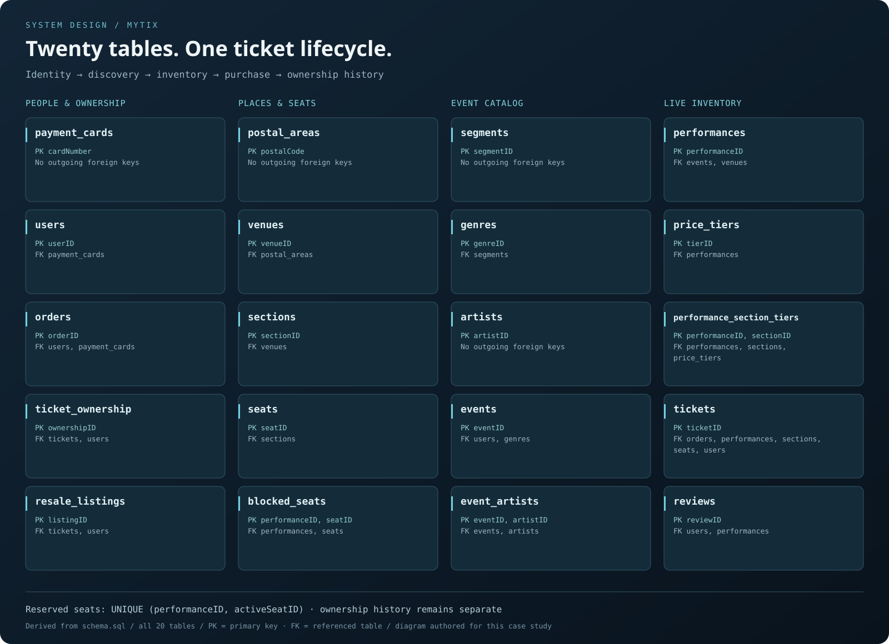
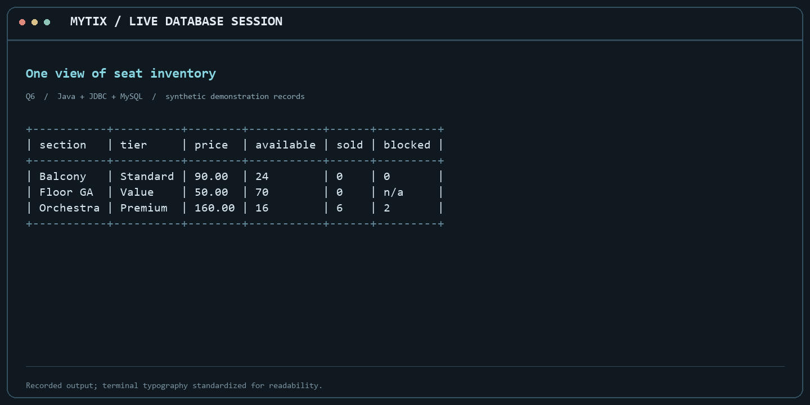
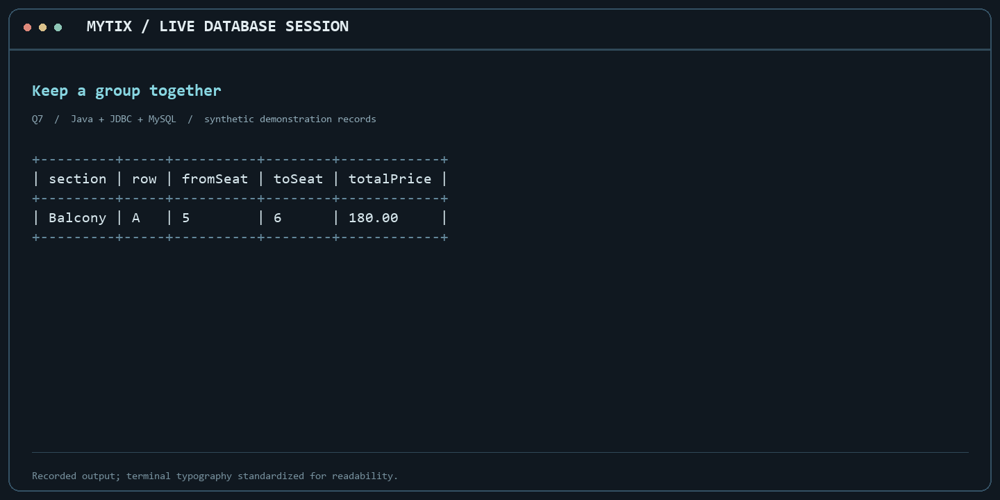

# Event Ticketing Database (MyTix)

[Documentation](wiki/Home.md) · [GitHub Wiki](https://github.com/ErfangYuan/event-ticketing-database/wiki) · [Known issues and roadmap](https://github.com/ErfangYuan/event-ticketing-database/issues)

A Java terminal application for discovering events, checking inventory and following a ticket from purchase through ownership changes. The interesting part is keeping the data consistent when a seat is sold, a show is cancelled or a ticket is resold.

Designed and implemented by Erfang Yuan. This is a portfolio copy with fresh history; it does not include course reports, grades, real credentials or private database snapshots.

## What is here

- A normalized 20-table MySQL schema, synthetic demonstration records and a Java/JDBC terminal interface.
- Customer and organizer workflows for bookings, inventory, cancellation, resale and reviews.
- Seven search views, including nearby events, filtered availability and consecutive seats within a budget.
- Nine reports covering revenue, organizer/customer activity, cancellations, sell-through, resale and review noun phrases.

## Run locally

Install JDK 17+, Maven and MySQL 8 (or a compatible server). Create a **new** database such as mytix_demo and a dedicated local database user; grant it access only to that database. In the MySQL client, explicitly select that new database before loading sql/schema.sql and then sql/load.sql. Never load these scripts into a database you want to preserve. The optional drop.sql is destructive.

Configure MYTIX_DB_HOST, MYTIX_DB_PORT, MYTIX_DB_NAME and MYTIX_DB_USER in your shell. For example, PowerShell uses `$env:MYTIX_DB_NAME='mytix_demo'`; Bash uses `export MYTIX_DB_NAME=mytix_demo`. The application reads process environment variables, **not .env files automatically**. .env.example is a list of names, not a loader.

Run `./run.ps1` on Windows or `bash run.sh` on Linux/macOS. The launcher asks for the MySQL password using masked local input if it is not already set. Passwords are not command-line arguments. Maven downloads JDBC 8.0.29 and OpenNLP 1.9.4 and compiles the program. Configure your own database; an empty password is not a deployment assumption.

R9 additionally needs compatible English OpenNLP models: en-sent.bin, en-token.bin, en-pos-maxent.bin and en-chunker.bin in src/lib/opennlp/. Models and third-party binaries are not bundled in this copy. Obtain compatible models from the Apache OpenNLP distribution, review their licenses and preserve the required names. Other searches and reports can run independently.

## A short tour

1. Start with Queries → Q6 and performance 1 to compare available, sold and blocked seats.
2. Try Q7, performance 1, quantity 2 and budget 500. The seed finds Balcony row A, seats 5–6, for 180.00.
3. Q1 near latitude 43.6426 / longitude -79.3871 finds demonstration venues around Toronto.
4. Reports → R1, city mode, dates 2026-01-01 through 2026-12-31 compares revenue. Date-dependent results naturally change with the system clock.

Sample names, cards and event records are synthetic. No payment processor is connected; this is a database/transaction study, not a production payment application. See [local verification and follow-up work](docs/verification.md).

## Real query results

The terminal tables preserve actual output from an isolated synthetic database. Styling only changes the terminal presentation.
